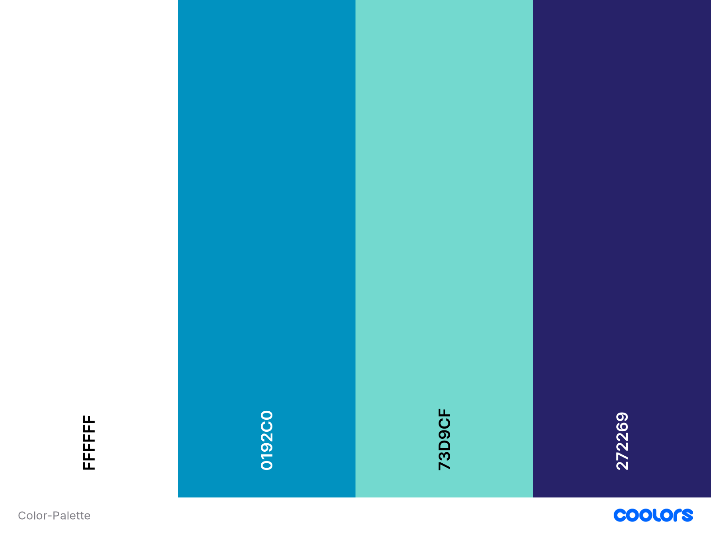
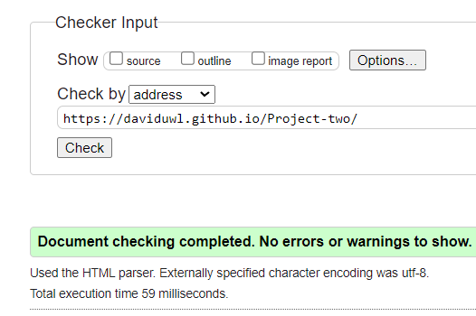
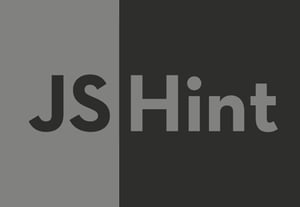
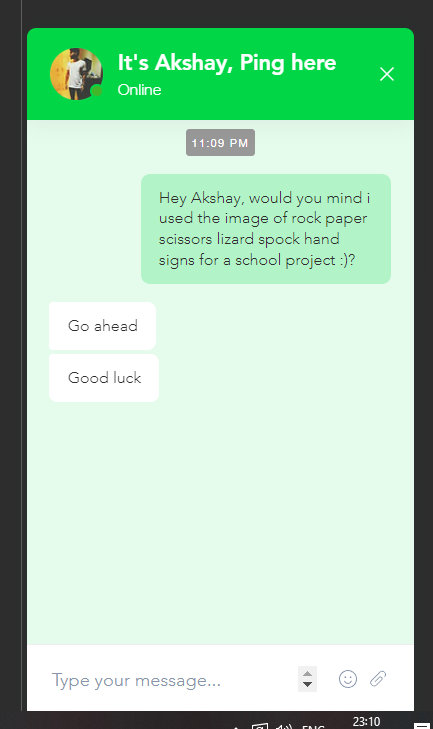

# Rock Paper Scissors lizard Spock Game
A website designed as a responsive page that allows users to play a modified game of rock paper scissors and view the rules. 

 
[Click here to view the game home page](https://daviduwl.github.io/Project-two/)

* [User Experience (UX)](#user-experience-ux)
  * [Initial Discussion](#initial-discussion)
  * [User Stories](#user-stories)
* [Design](#design)
  * [Colour Palette](#colour-palette)
  * [Typography](#typography)
  * [Imagery](#imagery)
  * [Features](#features)
* [Technologies Used](#technologies-used)
  * [Languages Used](#languages-used)
  * [Libraries & Programs Used](#libraries--programs-used)
* [Deployment & Local Development](#deployment--local-development)
  * [Deployment](#deployment)
* [Testing](#testing)
  * [W3C Validator](#w3c-validator)
  * [Solved Bugs](#solved-bugs)
  * [Known Bugs](#known-bugs)
  * [Tesing User Stories](#testing-user-stories)
  * [Full Testing](#full-testing)
* [Credits](#credits)
* [Media](#media)
* [Acknowledgments](#acknowledgments)

## User Experience (UX)
### Initial Discussion
Rock Paper Scissors Lizard Spock (referred to as RPSLS for short) was designed to be a fun interactive game that can be played with two players
or against the computer. 
 

### User Stories
#### First Time Visitor Goals
* To quickly be able to see the rules and play the game.
* Have a sense of familiarity with rock paper scissors but learn the extra complexity of the extra two choices.
#### Returning Visitor Goals
*  To be able to quickly access the game without needing to read the rules beforehand. 


## Design
### Colour Palette 

I create the page with a darker purple overall background, this allows the foreground to stand out and in front when information is changing. With the blue text and white borders, i think its pops a little bit better. The color palette image was created with the [Coolors](http://www.coolors.co) website.

### Typography 
The font Roboto was imported using google fonts.

### Imagery
The images on this site have been granted permission from the owners. They have been credited in the [Credits](#Credits) section.

### Features
The website is made up of three pages:
* Home Page
* Rules Page
* Game page


This sites navigation is done through two methods:

  

  the home page has two buttons for navigation, giving it a game like feel

The rules page contains a navigation bar. 

* Home Screen
  * The Home screen displays an image that catches the eye with bright colours against the darker background, and also explains the win conditions of the game. 
  * There are two buttons for navigation, with interactive styling, giving a game like feel as soon as the user visits the site. 
  * The home page is quite minimalist, making the user feel like they are at the title screen of a video game about to press start. 
   
  
* Rules Page
  * The Rules page, similiar to the home page is kept quite minimal. A quick explanation of how to play and how the winner is decided and any extra features are described, this allows the player to quickly get into the game without having to spend too long reading, this keeps the user on the site before they become bored. 
  * The rules page explains one key feature accompanied by an image describing how the player can play against the computer instead of another player. 

* Game Page <br>
The Game page in keeping style with the minimalist look, allows the player to focus on just the game and not be distracted by the webpage or browser. The below outlines the features of the game page.
  
  1. timer: Upon first click for either player one or player two, the round timer will begin to count down to 0. when the timer hits 0, the winner will be calculated.
  2. A round counter will count each round as the happen until three rounds have been played.
  3. A score counter for both players, keeping a log of each win/draw/lose.
  4. Each player will be prompted for their names when the page has loaded, this will then be assigned to each players section. 
  5. Both players choices are chosen in this section, they can be chosen while the timer runs, but once it hits zero, they can no longer be changed as the buttons are disabled.
  6. This section shows the players name and their choice, this updates with every choice and change the player makes until the timer hits zero. 
  7. This displays the outcome of the round. 
  8. Next round/Reset button that appears after the winner has been displayed. This allows the player to progress to the next round or reset the game to zero and play again! 
  9. This section appears once three rounds has been played and displays the winner from a best of three win condition. 
* Player 1 can play against the computer by entering the name "computer" for player 2. This will let the computer make a choice and not display it until the timer reaches zero. The buttons will also be disabled, so player 1 can't always let themselves win! 
<br>
* Social media footer
  * All pages contain a social media footer that contains all social media links that could link to the game developers pages for exposure. 


## Technologies Used 

### Languages Used 
A Combination of HTML/CSS/Javascript was used for the creation of this site. 

#### Examples of Javascript used 
* The code below prompts the players for their names, the function checks that the player name did not press the cancel( !=null) button, and then assigns the name value to the playerX.name object key. It also trims any whitespace so that the player does not enter multiple spaces and changes the layout of the page. 
  * If the player does press cancel, it assigns the value of Player X instead of leaving the player name blank, or causing an error by trying to read a null. 
```javascript 
function promptPlayerName() {
    /* window prompt taking player names, if empty assigns default names */
    player1.name = window.prompt("player 1 Name:");
    if (player1.name != null) {
        player1.name = player1.name.trim();
        document.getElementById("p1name").innerHTML = player1.name;
    } else {
        player1.name = "player 1";
        document.getElementById("p1name").innerHTML = player1.name;
    }

    player2.name = window.prompt("player 2 Name:");
    if (player2.name != null) {
        player2.name = player2.name.trim();
        document.getElementById("p2name").innerHTML = player2.name;
    } else {
        player2.name = "Player 2";
        document.getElementById("p2name").innerHTML = player2.name;
    }
} 
```

* The below code determines the name of player 2 and if it is computer, it disables the buttons for player 2. Once the timer hits zero, it triggers a function that generates a random number between zero and four which is mapped to a choice for player 2. It also becomes case insensitive with the toLocaleLowerCase() method and removes whitespace with the trim() method if they accidentally add a space at the end. 

```javascript 
function disableButtonsP2AI() {
    /* disables the buttons of player 2 if they are playing against computer */
    if (player2.name.toLocaleLowerCase().trim() === "computer") {
        let aiButtons = document.getElementsByClassName("p2button");
        for (let button of aiButtons) {
            button.disabled = true;
        }
    }
}

function playAgainstAI() {
    /* if playing against computer, logic will determine the choice of computer */

    if (!player2.choice) {
        let aiChoice = Math.floor(Math.random() * 5);
        switch (aiChoice) {
            case 0:
                player2.choice = "rock";
                break;
            case 1:
                player2.choice = "paper";
                break;
            case 2:
                player2.choice = "scissors";
                break;
            case 3:
                player2.choice = "lizard";
                break;
            case 4:
                player2.choice = "spock";
                break;
        }
        updatePlayerUIChoices();
    }
}
``` 

* One particularily interesting technique i learned with creating this is that rather than having a function have one purpose, it can be written in a way that it becomes a toggle switch. The below code uses a global variable called buttonsAllowed which contains a boolean value of true and buttons(globally declared variable containing all button values). When the game is initialised, buttonsAllowed is true so the buttons are clickable, the players can make their first choice and begin the timer. Once this timer hits zero, the toggleButtons function can be called again, disabling all buttons. It can then be called again when the next round is initiated, thus re-enabling the buttons. 

```javascript
function toggleButtons() {
    /* toggle function that disables and enables the buttons depending on game state */
    for (let button of buttons) button.disabled = buttonsAllowed;
    buttonsAllowed = !(buttonsAllowed);
}
```

### Libraries & Programs Used
Github was used as a repository to store website files and code. <br>
Gitpod used as the coding environment with git for version control. <br>
Google Dev Tools were used for troubleshooting and testing media queries for multiple device viewports. <br>
Google Fonts used to import website fonts. <br>
Font awesome used to import icons used throughout the website. <br>

## Deployment & Local Development

### Deployment
Github Pages was used to deploy the live website. <br>
This can be acheived by following: <br>
  1. Log into your github account
  2. Select the repository you wish to go live with.
  3. Open the repository settings. 
  4. In your source selection, select main from your branch drop down menu, then select root from your folder menu. 
  5. Click the associated save button and your page will then be deployed via the shown URL. 

## Forking/Cloning 
To create a fork for this repository: 
* Navigate to the url - https://github.com/DavidUWL/Project-two
  * In the top right corner, click on the Fork dropdown. 
  * Create a new fork
  * Name the repository and/or give it a description - Click create fork. 
* You have now created a fork of this repository! 

## Testing
Throughout the creation of this website build, Google/Chrome dev tools were used to troubleshoot and test different 
elements as they were added, along with the use of the debugger keyword and variable logging to the console. Dev tools was also used to verify the websites responsiveness across multiple viewing platforms. <br>
<br>

### W3C Validator
The HTML and CSS code of this site was validated with the use of the W3C validator and jShint. 
<p>
    <a href="http://jigsaw.w3.org/css-validator/check/referer">
        
    </a>
</p>


    



### Solved Bugs
* During the project a few javascript bugs were encountered, namely: <br>
  * A bug where when playing against the computer, the buttons would not be disabled after the first round. This was countered by having the newRound function call the function that disabled the P2 buttons when a new round starts. 
  * A bug where the scorecard would not update on reset, this was due to the roundwinner key not being emptied before calling the updateScoreUI() function. 
  * A bug that made it look like win conditions were being fulfilled, however the updateScoreUI() function was being called too early.
  * A bug where regardless of the player 2 pick, the computer would force a choice over it, this was remedied by wrapping the playAgainstAI() code block in an if statement that verifies if the player2.choice value is truthy and does not execute. 

### Known Bugs
* During the developement, i used the play against the computer function so that i did not have to constantly select choices for player 2. This helped to test other functions, what i didn't consider was that i needed the option for player two to make no choice at all and the game to default. Currently the game will make a selection for player two if they do not make a choice, i do plan in the future to allow player 2 to make no choice at all and the current round will reset. 
* Depending on the screen resolution, the home page buttons will be pushed into the footer slightly. This was missed in the testing using dev tools. it will be corrected in a future commit. 

### Testing User Stories 
#### First time Vistor
* To quickly be able to see the rules and play the game.
  * Home page directs the user quickly with the minimalist design and large buttons linking to the respective pages. 
* Have a sense of familiarity with rock paper scissors but learn the extra complexity of the extra two choices.
  * The game is played just like normal, but the extra two choices are naturally folded in via the game page. 
#### Returning Visitor
 *  To be able to quickly access the game without needing to read the rules beforehand. 
   * Play accessible through all navigable pages. 

## Full testing
A number of methods were used to fully test this website.
* Two browsers were used:
  * Firefox
  * Google Chrome

* Three devices were used:
  * Desktop PC with three different resolution monitors. 
  * Huawei p30 phone.
  * Samsung Galaxy Tab A Tablet.

* Links 
  1. Home page buttons and nav bar links interacted with across multiple device resolutions to maintain usability with media query restructuring. 
  2. Footer links tested that they link to their corresponding websites. testing that when the link is interacted with, it opens a new window to allow the user to maintain their position on the current website. 

* Game section choice options
  * all choices interacted with from both opening positions of player one and player two. 
  * Verified that if player playing is playing against computer, that player 2 buttons are disabled. 
  * When each round ends, that all buttons are disabled. 
  * Tested all buttons across different screen resolutions to verify media queries do not interfere with interactions. 


## credits
### Content
All content on this site was written by myself for the game RPSLS. 

## Media
All images on this site were used with the permission of the owners/people involved. 

[Akshay bahadur image](https://static.wixstatic.com/media/903056_39aa9523c70a428684be9744580b0b1b~mv2.png/v1/fill/w_844,h_844,al_c,q_90,usm_0.66_1.00_0.01,enc_auto/903056_39aa9523c70a428684be9744580b0b1b~mv2.png) <br>
 <br>
 

## Acknowledgments
[Aleks G](https://stackoverflow.com/a/66565163) For the excellent tip on flex box footer formatting. <br> 
[Derek Mcauley](https://github.com/derekmcauley7) For his guidance as my Code Institute mentor. <br>
[kera cudmore](https://github.com/kera-cudmore/readme-examples/blob/main/milestone1-readme.md) For her fantastic Readme Template.
